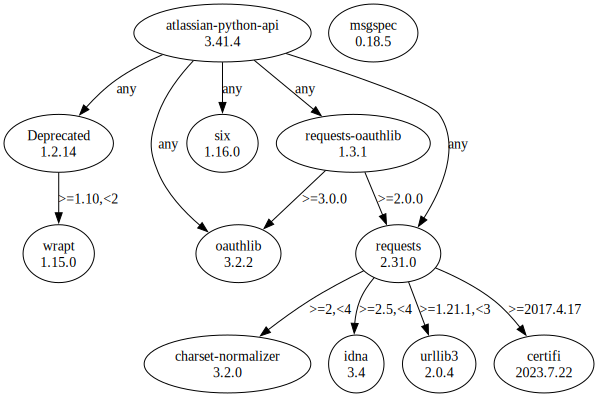

# Third Party Dependencies

<!--[[[fill sbom_sha256()]]]-->
The [SBOM in CycloneDX v1.4 JSON format](https://git.sr.ht/~sthagen/tutkia/blob/default/etc/sbom/cdx.json) with SHA256 checksum ([6609d5fb ...](https://git.sr.ht/~sthagen/tutkia/blob/default/etc/sbom/cdx.json.sha256 "sha256:6609d5fb170510d97d818d0d1fb4c93821dccbd15aa56452afdcfcff80bd18fe")).
<!--[[[end]]] (checksum: d74cc21917d5ae0bfb52004f4053b7c4)-->
## Licenses 

JSON files with complete license info of: [direct dependencies](direct-dependency-licenses.json) | [all dependencies](all-dependency-licenses.json)

### Direct Dependencies

<!--[[[fill direct_dependencies_table()]]]-->
| Name                                                                          | Version                                                         | License                 | Author           | Description (from packaging data)                                                                        |
|:------------------------------------------------------------------------------|:----------------------------------------------------------------|:------------------------|:-----------------|:---------------------------------------------------------------------------------------------------------|
| [atlassian-python-api](https://github.com/atlassian-api/atlassian-python-api) | [3.41.3](https://pypi.org/project/atlassian-python-api/3.41.3/) | Apache Software License | Matt Harasymczuk | Python Atlassian REST API Wrapper                                                                        |
| [msgspec](https://jcristharif.com/msgspec/)                                   | [0.18.4](https://pypi.org/project/msgspec/0.18.4/)              | BSD License             | Jim Crist-Harif  | A fast serialization and validation library, with builtin support for JSON, MessagePack, YAML, and TOML. |
<!--[[[end]]] (checksum: 286b98c242d9eb04a3eea35578ce886d)-->

### Indirect Dependencies

<!--[[[fill indirect_dependencies_table()]]]-->
| Name                                                                | Version                                                     | License                              | Author                                   | Description (from packaging data)                                                                       |
|:--------------------------------------------------------------------|:------------------------------------------------------------|:-------------------------------------|:-----------------------------------------|:--------------------------------------------------------------------------------------------------------|
| [Deprecated](https://github.com/tantale/deprecated)                 | [1.2.14](https://pypi.org/project/Deprecated/1.2.14/)       | MIT License                          | Laurent LAPORTE                          | Python @deprecated decorator to deprecate old python classes, functions or methods.                     |
| [certifi](https://github.com/certifi/python-certifi)                | [2023.7.22](https://pypi.org/project/certifi/2023.7.22/)    | Mozilla Public License 2.0 (MPL 2.0) | Kenneth Reitz                            | Python package for providing Mozilla's CA Bundle.                                                       |
| [charset-normalizer](https://github.com/Ousret/charset_normalizer)  | [3.2.0](https://pypi.org/project/charset-normalizer/3.2.0/) | MIT License                          | Ahmed TAHRI                              | The Real First Universal Charset Detector. Open, modern and actively maintained alternative to Chardet. |
| [idna](https://github.com/kjd/idna)                                 | [3.4](https://pypi.org/project/idna/3.4/)                   | BSD License                          | Kim Davies <kim@cynosure.com.au>         | Internationalized Domain Names in Applications (IDNA)                                                   |
| [oauthlib](https://github.com/oauthlib/oauthlib)                    | [3.2.2](https://pypi.org/project/oauthlib/3.2.2/)           | BSD License                          | The OAuthlib Community                   | A generic, spec-compliant, thorough implementation of the OAuth request-signing logic                   |
| [requests-oauthlib](https://github.com/requests/requests-oauthlib)  | [1.3.1](https://pypi.org/project/requests-oauthlib/1.3.1/)  | BSD License                          | Kenneth Reitz                            | OAuthlib authentication support for Requests.                                                           |
| [requests](https://requests.readthedocs.io)                         | [2.31.0](https://pypi.org/project/requests/2.31.0/)         | Apache Software License              | Kenneth Reitz                            | Python HTTP for Humans.                                                                                 |
| [six](https://github.com/benjaminp/six)                             | [1.16.0](https://pypi.org/project/six/1.16.0/)              | MIT License                          | Benjamin Peterson                        | Python 2 and 3 compatibility utilities                                                                  |
| [urllib3](https://github.com/urllib3/urllib3/blob/main/CHANGES.rst) | [2.0.4](https://pypi.org/project/urllib3/2.0.4/)            | MIT License                          | Andrey Petrov <andrey.petrov@shazow.net> | HTTP library with thread-safe connection pooling, file post, and more.                                  |
| [wrapt](https://github.com/GrahamDumpleton/wrapt)                   | [1.15.0](https://pypi.org/project/wrapt/1.15.0/)            | BSD License                          | Graham Dumpleton                         | Module for decorators, wrappers and monkey patching.                                                    |
<!--[[[end]]] (checksum: 39dcc30828e681ba450e4618f35a5503)-->

## Dependency Tree(s)

JSON file with the complete package dependency tree info of: [the full dependency tree](package-dependency-tree.json)

### Rendered SVG

Base graphviz file in dot format: [Trees of the direct dependencies](package-dependency-tree.dot.txt)



### Console Representation

<!--[[[fill dependency_tree_console_text()]]]-->
````console
atlassian-python-api==3.41.3
├── Deprecated [required: Any, installed: 1.2.14]
│   └── wrapt [required: >=1.10,<2, installed: 1.15.0]
├── oauthlib [required: Any, installed: 3.2.2]
├── requests [required: Any, installed: 2.31.0]
│   ├── certifi [required: >=2017.4.17, installed: 2023.7.22]
│   ├── charset-normalizer [required: >=2,<4, installed: 3.2.0]
│   ├── idna [required: >=2.5,<4, installed: 3.4]
│   └── urllib3 [required: >=1.21.1,<3, installed: 2.0.4]
├── requests-oauthlib [required: Any, installed: 1.3.1]
│   ├── oauthlib [required: >=3.0.0, installed: 3.2.2]
│   └── requests [required: >=2.0.0, installed: 2.31.0]
│       ├── certifi [required: >=2017.4.17, installed: 2023.7.22]
│       ├── charset-normalizer [required: >=2,<4, installed: 3.2.0]
│       ├── idna [required: >=2.5,<4, installed: 3.4]
│       └── urllib3 [required: >=1.21.1,<3, installed: 2.0.4]
└── six [required: Any, installed: 1.16.0]
msgspec==0.18.4
````
<!--[[[end]]] (checksum: a0fd926f4a7fe8925800c52ef68aaa4d)-->
